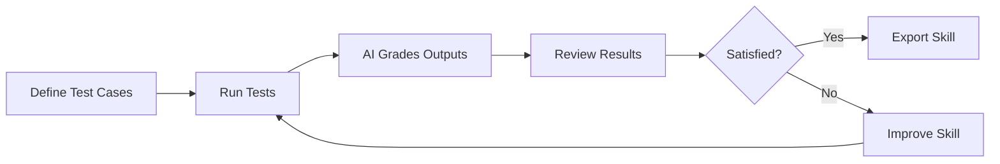
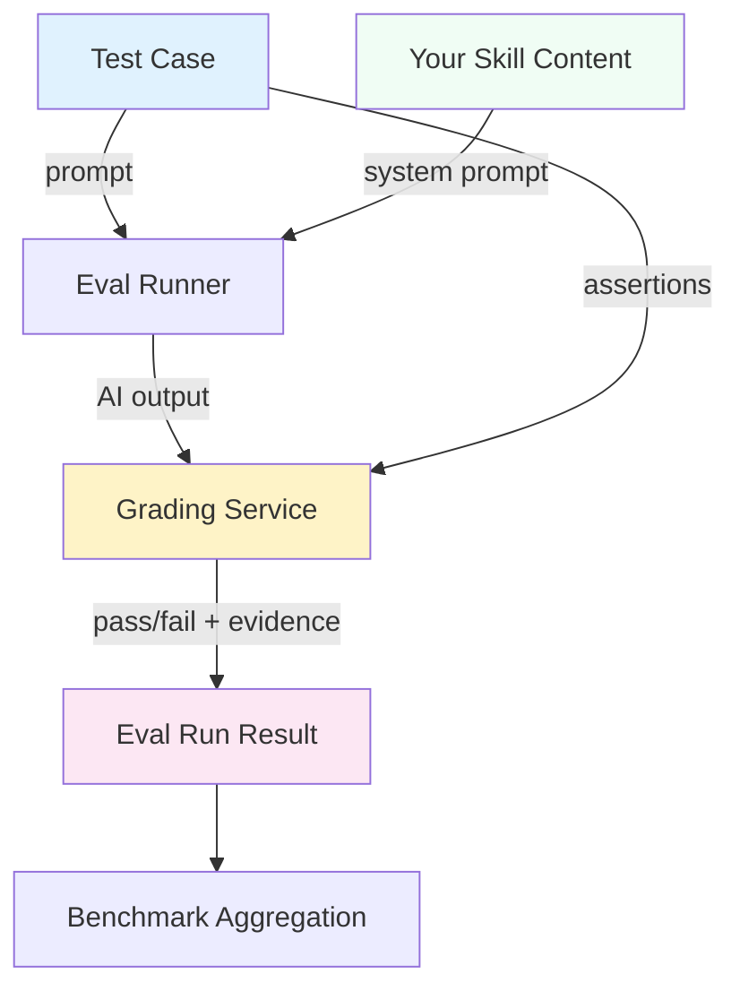
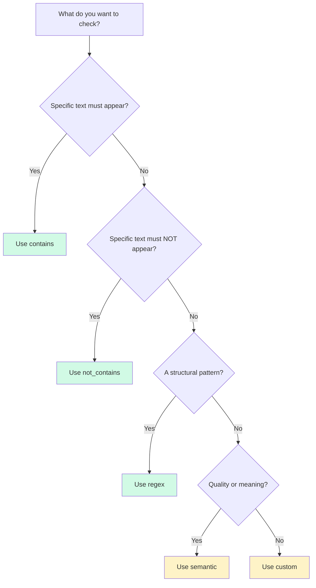
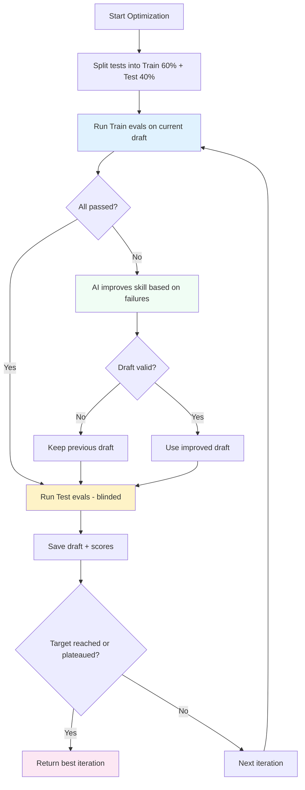

# Skill Tests — Complete Guide

> **Audience**: Users of SkillSpell who want to understand how to test, evaluate, and improve their AI skills using the built-in evaluation system.

---

## Table of Contents

- [Overview](#overview)
- [Core Concepts](#core-concepts)
  - [What is a Skill Test?](#what-is-a-skill-test)
  - [How Testing Works at a High Level](#how-testing-works-at-a-high-level)
- [Test Cases](#test-cases)
  - [Creating a Test Case](#creating-a-test-case)
  - [Test Case Fields](#test-case-fields)
  - [Assertions — The Heart of Testing](#assertions--the-heart-of-testing)
  - [AI-Generated Test Cases](#ai-generated-test-cases)
  - [Bulk Creation](#bulk-creation)
  - [Limits](#limits)
- [Running Tests](#running-tests)
  - [How Execution Works](#how-execution-works)
  - [Baseline Comparison](#baseline-comparison)
  - [Multiple Runs per Case](#multiple-runs-per-case)
  - [Version Targeting](#version-targeting)
  - [Version-Scoped Test Cases](#version-scoped-test-cases)
- [Grading System](#grading-system)
  - [Deterministic Grading](#deterministic-grading)
  - [AI-Powered Grading](#ai-powered-grading)
  - [Grading Results](#grading-results)
  - [Extracted Claims](#extracted-claims)
  - [Eval Self-Critique](#eval-self-critique)
- [Test Results — The Outputs Tab](#test-results--the-outputs-tab)
  - [Navigating Results](#navigating-results)
  - [Output Comparison Modes](#output-comparison-modes)
  - [Run-vs-Run Comparison](#run-vs-run-comparison)
- [Benchmarks — The Benchmark Tab](#benchmarks--the-benchmark-tab)
  - [Summary Statistics](#summary-statistics)
  - [Per-Assertion Breakdown](#per-assertion-breakdown)
  - [Per-Test-Case Breakdown](#per-test-case-breakdown)
  - [Discrimination Analysis](#discrimination-analysis)
  - [Analyst Notes](#analyst-notes)
  - [Iteration History](#iteration-history)
  - [Version Comparison](#version-comparison)
  - [Variance Statistics](#variance-statistics)
- [Feedback System](#feedback-system)
  - [Rating Runs](#rating-runs)
  - [Suggested Fixes](#suggested-fixes)
- [Failure Explanations](#failure-explanations)
  - [Synthesized Mode](#synthesized-mode)
  - [AI-Explained Mode](#ai-explained-mode)
- [AI-Powered Suggestions](#ai-powered-suggestions)
  - [Test Prompt Suggestions](#test-prompt-suggestions)
  - [Smart Test Generation](#smart-test-generation)
  - [Assertion Replacement Suggestions](#assertion-replacement-suggestions)
- [Automated Skill Optimization](#automated-skill-optimization)
  - [How the Optimization Loop Works](#how-the-optimization-loop-works)
  - [Regression Protection](#regression-protection)
  - [Train/Test Split](#traintest-split)
  - [Real-Time Progress](#real-time-progress)
  - [Feedback Integration](#feedback-integration)
  - [Optimization Configuration](#optimization-configuration)
  - [Cost Tracking](#cost-tracking)
  - [When Optimization Completes](#when-optimization-completes)
- [End-to-End Workflow](#end-to-end-workflow)
- [Glossary](#glossary)

---

## Overview

Skill Tests is SkillSpell's built-in evaluation system that lets you **define test cases, run them against your skill, grade the outputs, and track quality over time**. It answers the fundamental question: *"Is my skill actually producing good results?"*

Without testing, changes to a skill are based on guesswork. The Skill Tests system makes quality **measurable** — you can see exactly which tests pass, which fail, and why. You can then use this data to improve your skill, either manually or through automated optimization.



---

## Core Concepts

### What is a Skill Test?

A **skill test** (also called an "eval case") is a defined scenario that checks whether your skill produces the expected behavior. Each test consists of:

1. **A prompt** — the input you send to the AI model
2. **Assertions** — the rules that the output must satisfy
3. **An optional expected output** — a reference answer for comparison

When you run a test, SkillSpell sends the prompt to the AI model with your skill applied as instructions, then checks the output against your assertions to determine if it passed or failed.

### How Testing Works at a High Level



The system works in three stages:

1. **Execution** — The prompt is sent to the AI model with your skill content as its system instructions. The model generates an output.
2. **Grading** — Each assertion is checked against the output. Simple checks like "contains" are evaluated instantly. Complex checks like "semantic meaning" use a separate AI grading call.
3. **Aggregation** — Results are compiled into benchmark statistics showing pass rates, scores, trends, and patterns.

---

## Test Cases

### Creating a Test Case

To create a test case, navigate to a skill's **Tests** page and click **"Add Test Case"**. You'll see an editor form where you define:

- A **name** for the test (e.g., "Should generate a REST API endpoint")
- The **prompt** to send to the AI
- Optionally, the **expected output** for reference
- One or more **assertions** to check

### Test Case Fields

| Field | Required | Description |
|-------|----------|-------------|
| **Name** | Yes | A short, descriptive label for the test (e.g., "Edge case: empty input") |
| **Prompt** | Yes | The input that will be sent to the AI model. This is what the model will respond to while following your skill's instructions. |
| **Expected Output** | No | A reference answer. Used by the AI grader as comparison context — it doesn't need to be an exact match. |
| **Assertions** | No (but recommended) | Rules that the output must satisfy. Without assertions, the test auto-passes. |
| **Context** | No | Optional background for the scenario. At run time it is sent to the model **before the prompt** (wrapped in a `<context>...</context>` block), in both the with-skill and baseline runs — so it shapes the output, and the comparison stays fair. |

### Assertions — The Heart of Testing

Assertions are the rules that define what "correct" output looks like. Each assertion has a **type** and a **value**. SkillSpell supports five assertion types:

#### `contains`
Checks if the output **includes** a specific text (case-insensitive).

| Property | Example |
|----------|---------|
| **Value** | `"async function"` |
| **Passes when** | The output contains the text "async function" anywhere |
| **Grading** | Deterministic (instant, no AI needed) |

**When to use**: Verifying that specific keywords, patterns, or phrases appear in the output.

#### `not_contains`
Checks that the output **does not include** a specific text (case-insensitive).

| Property | Example |
|----------|---------|
| **Value** | `"TODO"` |
| **Passes when** | The output does NOT contain the text "TODO" |
| **Grading** | Deterministic (instant, no AI needed) |

**When to use**: Ensuring the output avoids forbidden terms, deprecated patterns, or placeholder text.

#### `regex`
Checks if the output **matches** a regular expression pattern.

| Property | Example |
|----------|---------|
| **Value** | `"export (default\|const) function \\w+"` |
| **Passes when** | The regex matches somewhere in the output |
| **Grading** | Deterministic (instant, no AI needed) |

**When to use**: Verifying structural patterns like function signatures, import statements, or specific formatting.

> **Note**: Regex patterns are limited to 200 characters for safety. The output is truncated to 50,000 characters before matching to prevent performance issues.

#### `semantic`
Uses AI to determine if the output **satisfies a semantic condition**.

| Property | Example |
|----------|---------|
| **Value** | `"The code follows the repository pattern with clear separation of concerns"` |
| **Passes when** | The AI grader determines the output meets the described quality criterion |
| **Grading** | AI-powered (uses a separate grading call) |

**When to use**: Checking qualitative aspects like code architecture, writing style, completeness, or adherence to design principles. This is the most powerful assertion type — it can evaluate things that simple text matching cannot.

#### `custom`
A free-form evaluation criterion interpreted by the AI grader.

| Property | Example |
|----------|---------|
| **Value** | `"The error handling covers all edge cases including null inputs, network failures, and timeouts"` |
| **Passes when** | The AI grader determines the criterion is met |
| **Grading** | AI-powered |

**When to use**: Complex, multi-faceted checks that don't fit neatly into the other categories.

#### Choosing the Right Assertion Type



**Best practice**: Mix deterministic assertions (`contains`, `not_contains`, `regex`) with semantic ones. Deterministic assertions are free, instant, and reliable. Semantic assertions catch nuanced quality issues but cost tokens.

### AI-Generated Test Cases

Instead of writing every test case manually, you can use the **"Generate Tests"** feature. This uses AI to:

1. **Analyze your skill** — Identifies key behaviors, edge cases, constraints, and weak areas
2. **Generate targeted test cases** — Creates diverse, adversarial tests with assertions already attached

The AI generation process uses a two-step approach called **Smart Test Generation**:

- **Step 1 (Skill Analysis)**: The AI reads your skill content and produces a structured analysis of what needs testing — key behaviors the skill must exhibit, specific edge cases, constraints and guardrails, areas likely to produce suboptimal output, and input variations that create meaningful test diversity.
- **Step 2 (Test Generation)**: Using the analysis, existing test case names (to avoid duplicates), and any prior eval failure patterns, the AI generates the requested number of test cases.

Generated tests are **not saved automatically**. They are returned for your review — you can edit, remove, or accept them before saving. You can request anywhere from 1 to 50 test cases at a time.

### Bulk Creation

After reviewing AI-generated test cases, you can save them all at once using the **"Save All"** button. This is more efficient than creating them one by one.

### Limits

- **Maximum 50 test cases per skill** — This limit prevents excessive resource usage and keeps the test suite manageable.
- The system enforces this limit both for individual creation and bulk creation. If you have 45 existing tests and try to bulk-create 10 more, you'll get an error explaining you can only add 5 more.

---

## Running Tests

### How Execution Works

When you click **"Run All"** or run specific test cases, the following happens for each test:

1. Your skill's content is loaded and used as the **system prompt** (the AI model's instructions)
2. The test case's **prompt** is sent as the user message
3. The AI model generates a response
4. The response is **graded** against the test's assertions
5. The result (output, grading, timing, token usage) is saved as an **eval run**

Tests run in **parallel** (up to 3 at a time) for faster execution.

### Baseline Comparison

One of the most powerful features is **baseline comparison**. When enabled (via the "Baseline" checkbox), each test runs **twice**:

1. **With skill** — The prompt is sent with your skill as the system prompt (the normal run)
2. **Without skill** — The same prompt is sent with **no system prompt** (the baseline)

Both outputs are graded independently. This lets you answer a critical question: **"Does my skill actually improve the output compared to the model on its own?"**

If an assertion passes both with and without the skill, it may be "non-discriminating" — meaning it doesn't actually test anything specific to your skill.

### Multiple Runs per Case

For more statistically reliable results, you can set **"Runs per case"** (1–5). Running each test multiple times reveals:

- **Variance** — How consistent are the results? If a test passes 3/5 times, it may be flaky.
- **Reliability** — High pass rates across multiple runs indicate the skill consistently works.

This is especially useful for benchmarking where you want to measure average performance rather than a single data point.

### Version Targeting

You can run tests against a **specific version** of your skill, not just the latest one. This is useful for:

- **Regression testing** — Did the latest change break something that worked before?
- **A/B comparison** — Which version produces better results?
- **Historical analysis** — How did version 3 perform compared to version 7?

Select a version from the version dropdown at the top of the Tests page. The system loads the skill content from that version's snapshot and runs tests against it.

### Version-Scoped Test Cases

Each test case is stamped with the skill version that existed when it was created (`createdAtVersion`). When you run tests against a specific older version, the system **only includes test cases that existed at that version** — test cases added later are automatically excluded. This prevents unfair testing of an old version against requirements that didn't exist yet.

A version badge (e.g., `v3`) appears on each test case so you can see when it was created.

---

## Grading System

After a test runs and produces output, the **Grading Service** evaluates each assertion. The grading system uses a hybrid approach: simple assertions are evaluated instantly with no AI, while complex ones are sent to an AI grader.

### Deterministic Grading

The `contains`, `not_contains`, and `regex` assertion types are evaluated **locally** with simple string operations. This means:

- **Zero AI token cost** — No API calls needed
- **Instant results** — Evaluated in microseconds
- **100% reliability** — No AI interpretation variability
- **Full confidence** — Results always have confidence = 1.0

### AI-Powered Grading

The `semantic` and `custom` assertion types require an AI grader. The grading service sends the following to the grading model:

- The original prompt
- The actual output
- The expected output (if provided)
- The assertions to evaluate
- The skill content (for claim verification)

The AI grader returns:
- **Pass/fail** for each assertion
- **Evidence** explaining why it passed or failed
- **Confidence score** (0–1) for its assessment

Each AI grading pass makes a fresh model call — grading results are **not cached**, so re-running an evaluation always re-grades the output. (Prompt caching reduces the token cost of re-sending the grader instructions and skill content within a run, but it's a token optimization, not a results cache: the model is still invoked each time.)

### Grading Results

Each graded test run receives:

| Metric | Description |
|--------|-------------|
| **Overall** | `pass`, `fail`, or `partial` |
| **Score** | 0–100, calculated as the percentage of assertions that passed |
| **Assertion Results** | Individual pass/fail for each assertion with evidence |
| **Graded At** | Timestamp of when grading completed |
| **Graded By** | `auto` (always automatic in current version) |

**Scoring**:
- **100** (pass) — All assertions passed
- **0** (fail) — No assertions passed
- **1–99** (partial) — Some assertions passed, some failed

### Extracted Claims

Beyond checking your predefined assertions, the AI grader can also **discover and verify claims** found in the output. These are verifiable statements that go beyond what your assertions check.

Claims are categorized into three types:

| Type | Description | Example |
|------|-------------|---------|
| **Factual** | Numbers, names, specific facts | "The function uses O(n log n) time complexity" |
| **Process** | Steps, ordering, workflows | "The code validates input before processing" |
| **Quality** | Completeness, correctness assessments | "All error cases are handled with appropriate messages" |

Each claim includes:
- The claim statement
- Whether it was verified as accurate
- Evidence for or against the claim
- Confidence score

Claims provide an extra safety net — they catch issues that your predefined assertions might miss.

### Eval Self-Critique

The grading system includes a **self-critique** feature. After grading all assertions, the AI grader reviews the test suite itself and provides feedback:

- **Suggestions** — Specific improvements to make your assertions more effective (e.g., "This assertion is too vague — consider checking for specific function signatures instead of just 'contains function'")
- **Overall assessment** — A one-sentence summary of the test suite's quality

This feedback appears in a collapsible **"Test Suite Feedback"** section below the assertion results.

---

## Test Results — The Outputs Tab

The **Outputs** tab provides qualitative review of individual test runs.

### Navigating Results

Results are organized by test case. You can:

- **Browse sequentially** using Previous/Next buttons
- **Jump to any run** using the sidebar panel that groups runs by test case
- **Filter by version** using the version dropdown

Each run shows:
- The **prompt** that was sent
- The **output** produced by the AI (with your skill active)
- The **baseline output** (if baseline comparison was enabled)
- **Output files** (if any were generated)
- **Grading results** with assertion-level detail
- **Timing and token usage** data

### Output Comparison Modes

When baseline comparison is enabled, the Outputs tab shows the skill output and baseline output for side-by-side review. This lets you see at a glance what your skill adds.

If baseline comparison was not enabled, you'll see a hint suggesting you turn it on: *"Run evals with the Baseline checkbox enabled to compare with-skill vs. without-skill outputs side by side."*

### Run-vs-Run Comparison

You can select **two specific runs** to compare them directly. This is useful for:

- Comparing the same test case across different skill versions
- Seeing how output changed after a skill improvement
- Analyzing variance between multiple runs of the same test

The comparison view shows:
- Side-by-side outputs with differences highlighted
- Grading comparison showing which assertions flipped (passed → failed or failed → passed)
- Metadata for both runs (version, timestamp, test case name)

To use this feature, select two runs using the checkboxes in the run list panel.

---

## Benchmarks — The Benchmark Tab

The **Benchmark** tab provides quantitative analysis of your test results.

### Summary Statistics

Four high-level metrics are displayed as cards:

| Metric | Description |
|--------|-------------|
| **Total Runs** | Number of eval runs executed |
| **Pass Rate** | Percentage of runs that passed all assertions (0–100%) |
| **Avg Score** | Average grading score across all runs (0–100) |
| **Avg Duration** | Average execution time per run |

### Per-Assertion Breakdown

A table showing how each **assertion type** performs across all runs:

| Column | Description |
|--------|-------------|
| **Assertion Type** | The type (contains, semantic, etc.) |
| **Total Checks** | How many times this type was evaluated |
| **Pass Count** | How many times it passed |
| **Pass Rate** | Percentage of passes |
| **Discrimination** | Whether this type discriminates between skill and baseline |

### Per-Test-Case Breakdown

A table showing how each **individual test case** performs:

| Column | Description |
|--------|-------------|
| **Test Name** | The name of the test case |
| **Run Count** | How many times it has been run |
| **Pass Count** | How many times it passed |
| **Pass Rate** | Percentage of passes |
| **Avg Score** | Average grading score for this specific test |

### Discrimination Analysis

This is one of the most powerful analytical features. When you run tests with baseline comparison enabled, the system compares each assertion's **with-skill pass rate** against its **baseline pass rate** and classifies it into one of five categories. Classification is based on a **10-percentage-point delta** between the two pass rates, not on a single-run pass/fail flip — this makes the signal robust when you run each case multiple times.

| Category | Meaning (pass rates as percentages) | Action |
|----------|-------------------------------------|--------|
| **Skill Adds Value** | With-skill pass rate is more than 10 points higher than baseline (`withSkillPassRate > baselinePassRate + 10`) | ✅ This assertion is working correctly — it validates something your skill contributes |
| **Non-Discriminating** | Both pass rates are very high (both ≥ 95%) — the check passes regardless of the skill | ⚠️ This assertion isn't actually testing your skill — consider replacing it with something more specific |
| **Skill Hurts** | Baseline pass rate is more than 10 points higher than with-skill (`baselinePassRate > withSkillPassRate + 10`) | 🔴 Your skill is making this worse — investigate what instruction is causing the regression |
| **Broken** | Both pass rates are very low (both ≤ 5%) — the check fails in both configurations | ❌ The assertion may be testing beyond the model's capability or have an incorrect expected value |
| **Inconclusive** | No baseline data, or the gap between pass rates is within ±10 points and neither "both high" nor "both low" applies | Run tests with baseline comparison enabled (and enough runs) to get a clearer classification |

> **How the thresholds combine**: extremes are checked first — both pass rates ≥ 95% → **Non-Discriminating**; both ≤ 5% → **Broken**. Otherwise the delta decides: with-skill leads by more than 10 points → **Skill Adds Value**; baseline leads by more than 10 → **Skill Hurts**. Everything else → **Inconclusive**.

**Why this matters**: Non-discriminating assertions waste evaluation resources and give a false sense of coverage. If 5 out of 8 assertions are non-discriminating, your skill might not be as well-tested as it appears.

### Analyst Notes

The benchmark system automatically generates **human-readable observations** about patterns in your data. These address eight types of patterns:

1. **Non-discriminating assertions** — Identifies assertions that pass regardless of skill
2. **Skill-hurts assertions** — Flags assertions that perform worse with the skill
3. **Broken assertions** — Flags assertions that fail everywhere
4. **High variance in pass rate** — Alerts to flaky or inconsistent tests (fires when pass-rate standard deviation exceeds **20 points**)
5. **Score variance** — Highlights when runs score inconsistently (fires when score standard deviation exceeds **15 points**)
6. **Consistently hard/easy cases** — Flags a case as *hard* when its pass rate is **below 30%** with **at least 2 runs**; the *easy* note appears only when **every** case passes **100%** of the time
7. **Duration/token tradeoffs** — Notes when the skill runs meaningfully slower (with-skill duration more than **2×** baseline) or uses more tokens (more than **1.5×** baseline)
8. **Statistical outliers** — Flags runs more than 2 standard deviations from the mean (requires **at least 3 runs** to compute)

These notes appear as cards at the bottom of the benchmark tab, providing actionable insights without requiring you to interpret raw statistics.

### Iteration History

The benchmark tracks how your skill improves over time across **iterations**. An iteration represents a batch of test runs — typically after making changes to the skill.

Each iteration shows:
- **Iteration number** and **skill version**
- **Pass rate** and **average score**
- **Win/loss/tie** compared to the previous iteration
- **Delta** — how much the pass rate and score changed

The **win/loss/tie** verdict uses a **±1 point** threshold on *either* the pass rate or the average score: it's a **win** if pass rate or score rose by more than 1 point, a **loss** if either fell by more than 1 point, and a **tie** otherwise (both changes within ±1).

```
Iteration 1 (v1) — 60% pass rate, score 72     [Baseline]
Iteration 2 (v2) — 75% pass rate, score 85     [Won: +15%, +13]
Iteration 3 (v3) — 74% pass rate, score 84     [Tied: -1%, -1]
Iteration 4 (v4) — 90% pass rate, score 93     [Won: +16%, +9]
```

This timeline makes it easy to see if your changes are actually improving the skill.

### Version Comparison

You can compare benchmark metrics between **two specific skill versions** side by side. This shows:

- Summary metrics for both versions (pass rate, score, duration, tokens)
- Per-test-case comparison with delta indicators
- An overall verdict (which version is better)

This is useful for making informed decisions about which version to keep or export.

### Variance Statistics

For more rigorous analysis, the benchmark includes **variance statistics** (mean ± standard deviation, min, max) for:

- **Pass rate** — How consistent is the pass/fail outcome?
- **Score** — How much do scores vary between runs?
- **Duration** — How consistent is execution time?
- **Tokens** — How much does token usage vary?

These statistics are computed separately for **with-skill** runs and **baseline** runs, with a **delta** showing the difference. This tells you not just whether the skill is better, but **by how much** and **how consistently**.

---

## Feedback System

### Rating Runs

After reviewing a test run's output, you can provide feedback:

- **Rating**: `good`, `bad`, or `neutral`
- **Feedback text**: Free-form comments about what was good or bad about the output
- **Suggested fix**: Optional description of how the skill should be changed to fix the issue

### Suggested Fixes

When you provide a suggested fix with your feedback, it gets stored alongside the run data. It is later fed into skill improvement through the **automated optimization loop**:

- Enabling the **"Include feedback"** option (surfaced in the UI as **"Improve from Feedback"**) gathers all negative/neutral feedback and failed/partial runs and injects them into the loop's **first** improvement iteration.
- Subsequent iterations use only fresh eval failures from the current loop.

> **Note**: "Improve from Feedback" is not a separate one-shot action — it is the same optimization loop described below, run with the feedback option turned on. Feedback influences skill improvement only through this loop.

---

## Failure Explanations

When a test run fails, you can request a **failure explanation** — a plain-language summary of what went wrong and how to fix it.

The system uses two modes depending on complexity:

### Synthesized Mode

For **simple failures** (1–2 failed assertions with clear evidence), the system builds an explanation directly from the grading data without any additional AI calls. This is instant and free.

The explanation includes:
- A summary of which assertions failed and why
- Suggestions for fixing the skill (extracted from eval feedback or generated from the failure pattern)

### AI-Explained Mode

For **complex failures** (3+ failed assertions or unclear evidence), the system makes a single AI call to analyze the failure holistically. This provides:

- **Summary**: A 2–3 sentence description of the behavioral gap between expected and actual output
- **Root cause**: The specific flaw in the skill instructions that caused the failure (with quotes from the skill when applicable)
- **Suggestions**: 1–3 concrete instruction changes to fix the failure

> The AI-explained mode costs approximately $0.005 per explanation.

---

## AI-Powered Suggestions

### Test Prompt Suggestions

When creating a test case, you can click **"Suggest Prompts"** to get up to 5 AI-generated test prompt ideas. These are based on:

- Your skill's name and description
- Your skill's content
- Any text you've already typed (to suggest completions/alternatives)

### Smart Test Generation

The **"Generate Tests"** feature creates complete test cases (with prompts, assertions, and expected outputs) using a two-phase AI process:

**Phase 1 — Skill Analysis**: The AI analyzes your skill and produces:
- Key behaviors the skill must exhibit
- Edge cases and boundary conditions
- Constraints and guardrails
- Areas likely to fail or produce suboptimal output
- Input variations that create meaningful test diversity
- Recommended assertion strategies

**Phase 2 — Test Generation**: Using the analysis, the AI generates diverse, targeted test cases. It also uses:
- Names of existing test cases (to avoid duplicates)
- Prior eval failure patterns (to focus on known problem areas)
- Grader feedback summaries (to target weak spots)

For large batches (`>20`), the system automatically splits into sequential API calls, passing previously generated case names to ensure diversity across batches.

### Assertion Replacement Suggestions

When the benchmark identifies **non-discriminating assertions** (those that pass both with and without the skill), you can request AI-suggested replacements. For each non-discriminating assertion, the system suggests:

- A **replacement assertion** that would better discriminate between skill and baseline
- The **type** of the replacement (e.g., switching from `contains` to `semantic`)
- **Reasoning** explaining why the replacement is more effective

You can review the suggestions, accept or reject each one, and apply them in bulk. After applying replacements, tests are automatically re-run with the updated assertions.

---

## Automated Skill Optimization

The most advanced feature is **automated skill optimization** — a loop that automatically improves your skill based on test results.

### How the Optimization Loop Works



Each iteration goes through these steps:

1. **Run training evals** — Execute test cases from the training set against the current skill draft
2. **Analyze failures** — Identify which assertions failed and why
3. **Improve the skill** — Use AI to modify the skill instructions based on the failure analysis
4. **Validate the improvement** — Check that the improved draft is structurally sound (no critical sections removed)
5. **Run test evals** — Execute the test set (never shown to the improvement AI) to measure real improvement
6. **Save and compare** — Record scores and determine if this iteration is better than previous ones

### Regression Protection

The loop keeps the **best-scoring draft** it has seen, not the most recent one. If an iteration's test score drops below the best so far, you'll see a **"Regression detected"** notice and the loop reverts to the best draft before continuing. A worse iteration can never overwrite a better one.

### Train/Test Split

The system splits your test cases into two groups:

- **Training set (60%)** — Used to identify failures and guide improvement. The AI sees these failures.
- **Test set (40%)** — Used to measure real improvement. The AI **never sees** these results during improvement.

This split prevents **overfitting** — the skill can't be tuned to pass specific tests while failing on new ones. The test set acts as an independent validation.

> **Important**: A proper blinded train/test split requires **at least 5 test cases**. With fewer than 5, the holdout would be too small to produce a meaningful score, so the loop falls back to using the **full set for both phases** — the improvement AI effectively sees every case, so the overfitting protection above does **not** apply. Add 5 or more test cases to get a genuine independent validation.

### Real-Time Progress

The optimization loop streams progress live to your browser. You'll see:

- Which step is running (train evals → analyzing → improving → test evals)
- Train/test pass counts and scores as they complete
- Accumulated cost
- Duration per iteration

### Feedback Integration

When starting optimization, you can choose to **include user feedback** from previous test runs. When enabled:

- The system gathers all negative/neutral feedback and historical failed runs
- This data enriches the **first iteration's** improvement prompt
- Subsequent iterations use only fresh eval failures from the current loop

This ensures that user knowledge captured through the feedback system is incorporated into the improvement process.

### Optimization Configuration

| Setting | Default | Description |
|---------|---------|-------------|
| **Max Iterations** | 3 | Maximum number of improve → eval cycles (1–5) |
| **Target Pass Rate** | 100% | Stop early when the **test** (holdout) pass rate reaches this threshold **and** the result is stable — see note below |
| **Include Feedback** | On when you have negative feedback, otherwise off | Whether to include user feedback in the first iteration |

> **Notes**:
> - Optimization requires at least **3 test cases** to start, and at least **5** for a blinded train/test split (see above).
> - If you include feedback with Max Iterations set to 1, the loop automatically runs 2 iterations — one to apply the feedback, one to measure the result.
> - **Early stopping**: the loop stops when the **test** pass rate (not the training pass rate) reaches the target — but not on the very iteration that sets a new best score. It runs one more iteration to confirm the gain holds before stopping. It also stops on a detected plateau.

### Cost Tracking

The optimization loop tracks estimated costs in real time, including:

- Token costs for eval execution (input + output tokens × model pricing)
- Token costs for grading
- Costs for the improvement (skill modification) calls

The total accumulated cost is displayed during and after the optimization run.

### When Optimization Completes

After the loop finishes (either by reaching the target pass rate, hitting the max iterations, or detecting a plateau), the system:

1. Identifies the **best iteration** (highest test score)
2. Returns the optimized skill draft with train and test scores
3. Shows the improvement delta (how much better the best iteration is vs. the starting point)
4. Lets you **approve** the improved skill or discard it

> **If no iteration beats the starting score**, there is nothing to apply — you'll see a message that your skill is already performing well against its current tests. Keep in mind that with a small test suite this can also mean the holdout was too small to register the change. Adding more test cases (or fixing coverage gaps when prompted) gives the loop more room to demonstrate improvement.

A **plateau** means the test score hasn't improved across the last 3 iterations (the newest score is no higher than the score from two iterations earlier). At that point, further iterations are unlikely to help, so the loop stops.

---

## End-to-End Workflow

Here's a recommended workflow for testing and improving a skill:

### 1. Create Initial Test Cases

- Start by manually creating 3–5 test cases covering the most important behaviors
- Use a mix of assertion types: `contains` for must-have keywords, `semantic` for quality checks
- Use **"Generate Tests"** to expand your test suite to 10–20 cases with AI help

### 2. Run Your First Tests

- Click **"Run All"** with baseline comparison **enabled**
- Set runs per case to 3 for more reliable data
- Wait for all tests to complete

### 3. Review Results

- Check the **Outputs tab** for qualitative review of individual runs
- Check the **Benchmark tab** for quantitative analysis
- Look at **Analyst Notes** for automatically detected issues
- Review **Discrimination Analysis** to find non-discriminating assertions

### 4. Improve Test Quality

- Replace non-discriminating assertions using the AI suggestion feature
- Add assertions for areas with gaps in coverage
- Address any test suite feedback from the grader's self-critique

### 5. Provide Feedback

- Rate runs as good/bad/neutral
- Add suggested fixes for failed runs
- This builds a knowledge base for the improvement system

### 6. Improve the Skill

Choose one of:
- **Manual improvement** — Edit the skill based on what you learned from test results
- **Automated optimization** — Let the system improve the skill automatically using the optimization loop

### 7. Verify Improvements

- Re-run tests after changes
- Check the **Iteration History** to see if scores improved
- Use **Version Comparison** to compare before and after

### 8. Iterate

Repeat steps 3–7 until you're satisfied with the skill's performance. The iteration history will show your progress over time.

---

## Glossary

| Term | Definition |
|------|------------|
| **Assertion** | A rule that an eval output must satisfy; can be deterministic (contains, regex) or AI-evaluated (semantic, custom) |
| **Baseline** | The AI model's output when run WITHOUT the skill, used as a control for comparison |
| **Benchmark** | Aggregated statistics across all test runs for a skill |
| **Claim** | A verifiable statement discovered by the AI grader in the output, beyond predefined assertions |
| **Deterministic assertion** | An assertion type (contains, not_contains, regex) evaluated locally without AI, giving instant results |
| **Discrimination** | Whether an assertion differentiates between with-skill and without-skill outputs |
| **Eval case** | A test case definition consisting of a prompt, assertions, and optional expected output |
| **Eval run** | A single execution of a test case, including the output, grading results, and timing data |
| **Grading** | The process of evaluating an AI output against a set of assertions |
| **Iteration** | One cycle of the optimization loop: run evals → analyze → improve → re-run |
| **Non-discriminating** | An assertion that passes both with and without the skill — it doesn't test skill-specific behavior |
| **Optimization loop** | The automated process of iteratively improving a skill based on test failures |
| **Pass rate** | The percentage of test runs where all assertions passed |
| **Regression protection** | During optimization, the loop reverts to the best draft whenever a new iteration scores worse on the test set |
| **Score** | A 0–100 value representing the percentage of individual assertions that passed in a single run |
| **Self-critique** | The AI grader's meta-analysis of the test suite quality, suggesting improvements to assertions |
| **Semantic assertion** | An assertion type evaluated by AI to check qualitative or meaning-based criteria |
| **Train/test split** | Dividing test cases into a training set (for guidance) and test set (for validation) during optimization |
| **Variance** | Statistical measure of how much results differ across multiple runs of the same test |
| **Version targeting** | Running tests against a specific historical version of a skill rather than the latest |
