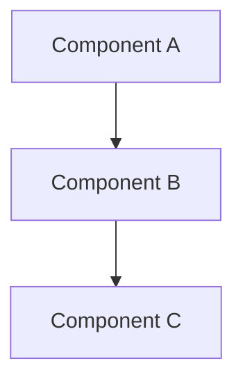
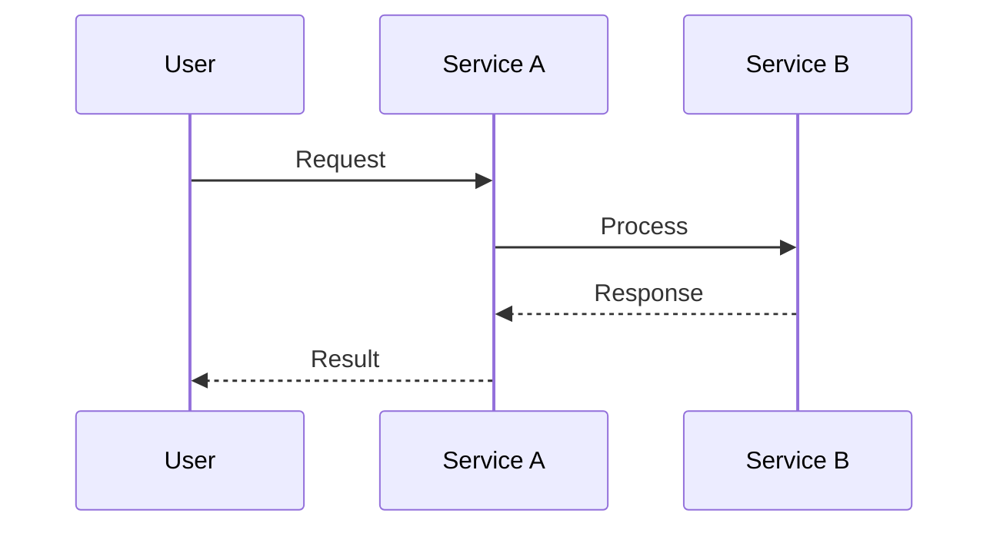

# System Design: [System or Feature Name]

**Author:** [Name]
**Date:** [YYYY-MM-DD]
**Status:** [Draft | In Review | Approved]
**Reviewers:** [Names or roles]

## Problem Statement

[A clear, concise statement of the problem being addressed. 2-5 sentences.
Do not mention the proposed solution here.]

## Context

[Describe the current state of the system, relevant history, and why this design
is needed now. Include links to related ADRs if applicable.]

### Constraints

- [Technical constraint 1]
- [Organizational constraint 1]
- [Regulatory constraint 1, if applicable]

### Assumptions

- [Assumption 1]
- [Assumption 2]

## Goals and Non-Goals

### Goals

- [Goal 1]
- [Goal 2]

### Non-Goals

- [Non-goal 1 — explicitly out of scope]
- [Non-goal 2]

## System Overview

[High-level description of the proposed system design.]

## Detailed Design

### Component 1: [Name]

[Description of the component, its responsibilities, and interfaces.]

### Component 2: [Name]

[Description of the component, its responsibilities, and interfaces.]

### Data Model

[Describe key data structures, storage choices, and data flow.]

### API Design

[Describe key API endpoints or interfaces, request/response formats.]

## Alternatives Considered

### Option 1: [Name]

[Summary and why it was not chosen.]

### Option 2: [Name]

[Summary and why it was not chosen.]

## Trade-off Analysis

| Dimension | Proposed Design | Alternative 1 | Alternative 2 |
|-----------|----------------|---------------|---------------|
| [Dim 1]   | [Rating — justification] | [Rating — justification] | [Rating — justification] |
| [Dim 2]   | [Rating — justification] | [Rating — justification] | [Rating — justification] |
| [Dim 3]   | [Rating — justification] | [Rating — justification] | [Rating — justification] |
| [Dim 4]   | [Rating — justification] | [Rating — justification] | [Rating — justification] |

## Key Interactions

## Deployment and Infrastructure

[Describe how the system will be deployed, infrastructure requirements,
and any operational considerations.]

## Security Considerations

- [Security consideration 1]
- [Security consideration 2]

## Observability

- **Logging:** [What will be logged and where]
- **Metrics:** [Key metrics to track]
- **Alerting:** [What conditions trigger alerts]

## Rollout Plan

1. [Phase 1: description]
2. [Phase 2: description]
3. [Phase 3: description]

## Consequences

### Positive

- [Benefit 1]
- [Benefit 2]

### Negative

- [Cost or risk 1]
- [Cost or risk 2]

### Neutral

- [Change 1]
