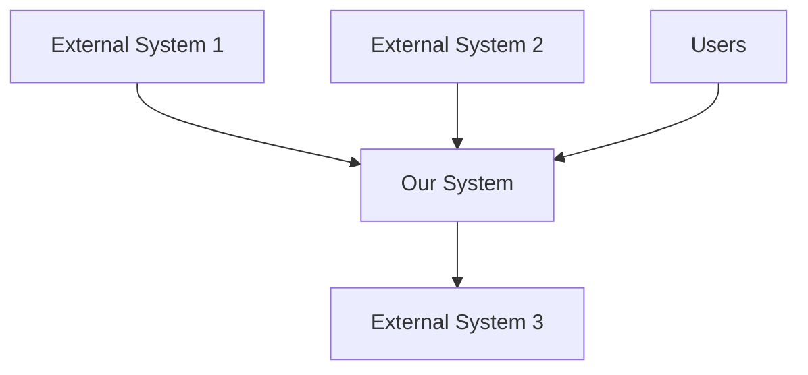
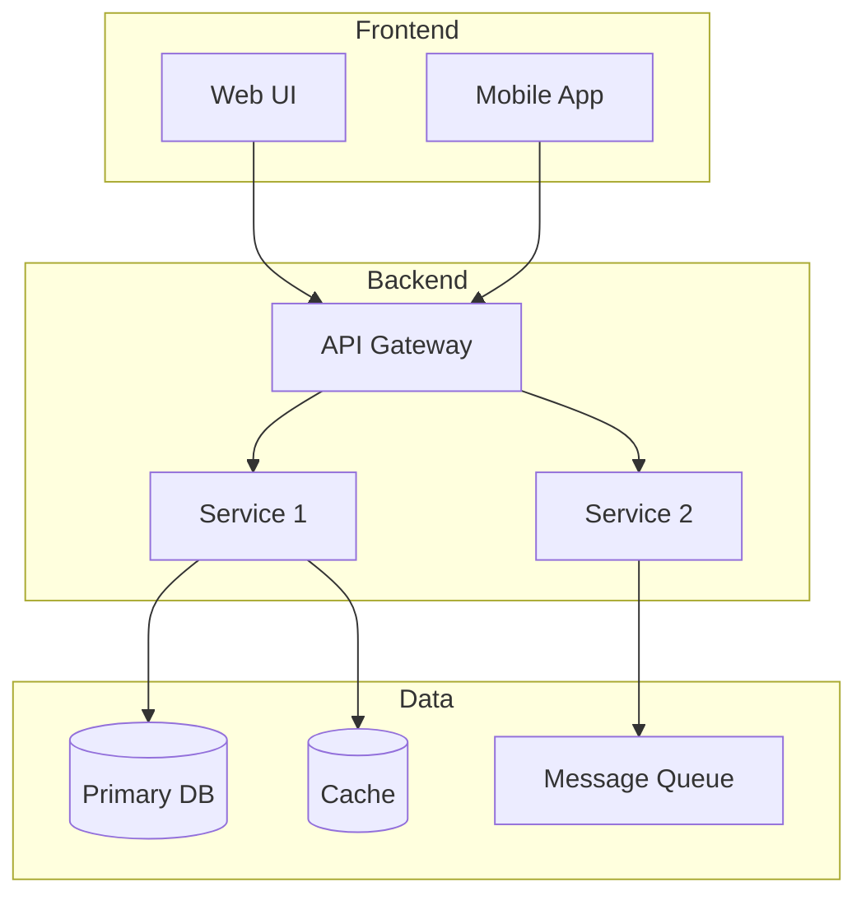

# Technical Architecture: [System or Platform Name]

**Author:** [Name]
**Date:** [YYYY-MM-DD]
**Status:** [Draft | In Review | Approved]
**Version:** [1.0]

## Purpose

[One paragraph explaining what this document covers and who it is for.]

## Problem Statement

[A clear, concise statement of the problem or need this architecture addresses.
2-5 sentences. Do not mention the proposed solution here.]

## Architectural Principles

1. **[Principle 1]** — [One-sentence explanation]
2. **[Principle 2]** — [One-sentence explanation]
3. **[Principle 3]** — [One-sentence explanation]

## System Context

[Describe how this system fits into the broader ecosystem.]

## Architecture Overview

[High-level description of the architecture style and key components.]

## Component Details

### [Component 1 Name]

- **Responsibility:** [What it does]
- **Technology:** [Tech stack]
- **Interfaces:** [APIs or protocols it exposes]
- **Dependencies:** [What it depends on]

## Data Architecture

### Data Flow

[Describe how data moves through the system.]

### Storage

| Data Store | Technology | Purpose | Consistency Model |
|-----------|------------|---------|-------------------|
| [Store 1] | [Tech]     | [Purpose] | [Model]         |

## Infrastructure and Deployment

[Describe the deployment topology and infrastructure.]

## Cross-Cutting Concerns

### Security
- **Authentication:** [Method]
- **Authorization:** [Method]
- **Data encryption:** [At rest and in transit approach]

### Observability
- **Logging:** [Approach and tools]
- **Metrics:** [Key metrics and tools]
- **Alerting:** [Alert conditions and escalation]

### Reliability
- **SLO:** [Target availability and latency]
- **Failover:** [Strategy]
- **Disaster recovery:** [RPO and RTO targets]

## Alternatives Considered

### Option 1: [Name]
[Summary and why it was not chosen.]

## Trade-off Analysis

| Dimension | Current Architecture | Alternative 1 |
|-----------|---------------------|---------------|
| [Dim 1]   | [Rating — justification] | [Rating — justification] |

## Consequences

### Positive
- [Benefit 1]

### Negative
- [Cost or risk 1]

## Decision Log

| Decision | ADR | Date | Status |
|----------|-----|------|--------|
| [Decision 1] | [Link] | [Date] | [Status] |

## Evolution Plan

1. **Short term (0-3 months):** [Plans]
2. **Medium term (3-12 months):** [Plans]
3. **Long term (1+ years):** [Plans]
