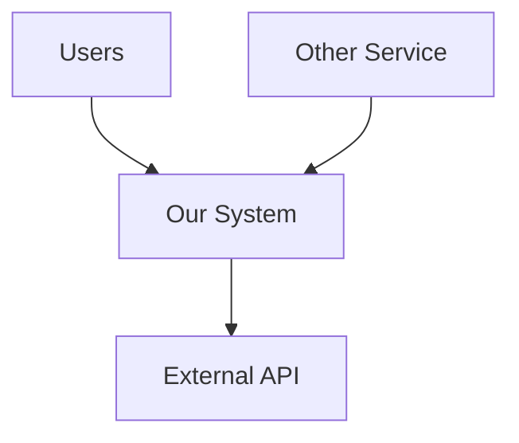
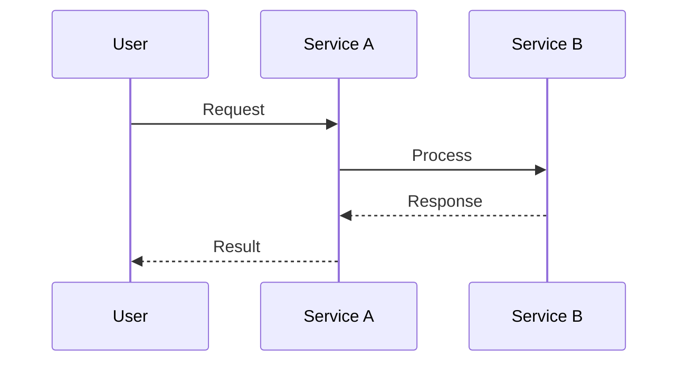
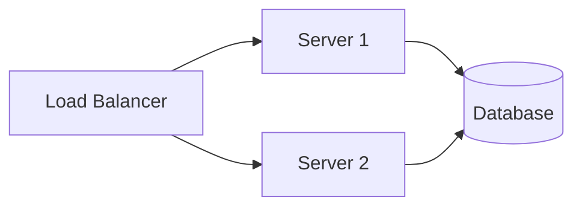

# Diagram Selection and Mermaid Syntax Guide

The agent reads this file ONLY when it needs Mermaid syntax for a specific diagram type.

## Diagram Selection by Document Type

| Document Type | Required | Recommended |
|--------------|----------|-------------|
| ADR | None | Before/after if decision changes interactions |
| System Design | System overview | Sequence diagrams, deployment diagram |
| Tech Architecture | Context + overview | Data flow, deployment, interaction flows |

## Common Patterns

### Context Diagram

### Sequence Diagram

### Deployment Diagram

## Rules
- Title every diagram with a heading and one-sentence description
- Label arrows with protocols or actions
- Keep to 7-12 nodes; split if more complex
- Node names must match terminology in the text
